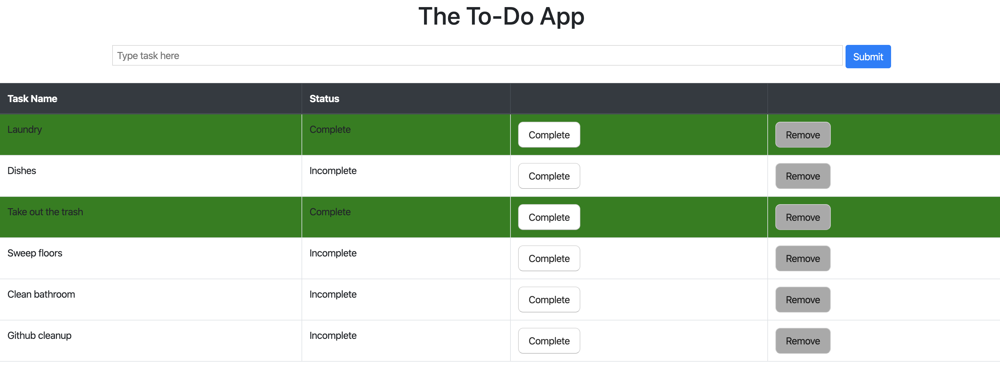

# TO-DO App

## Description
For this weekend project (#3), we were given the task of creating a TO-DO list application, which gives the user the opportunity to create tasks (which will add them and store them to a local database), mark them as complete (or back to incomplete if needed), or remove the task entirely (delete from the database).

## Screen Shots

#### Task View

## Prerequisites

-   node.js
-   PG
-   PostgreSQL

## Installation

1. In your editor of choice, navigate to the main project directory, open your terminal and type `npm install` in the command line, in order to install the dependencies for this project
2. Database setup -
    -   a.  Create a database named `weekend_to_do_app`
    -   b.  Execute all of the scripts from `database.sql` in your `weekend_to_do_app` database
3. Run `npm start` in your terminal to spin up the server
4. Open localhost:5000 in your browser

## Usage

1. Enter a task and click submit to add it to the database
2. Click complete to complete a task
3. Click complete again to switch a completed task back to incomplete
4. Click remove to delete the task from the database

## Built With
-   node.js
-   express.js
-   jQuery
-   CSS
-   Bootstrap
-   PG

## Acknowledgement
Huge thanks to Prime Digital Academy(Minneapolis), my instructor, Mary, and my cohort, Trifid!

## Support
No longer being supported... designed for learning purposes